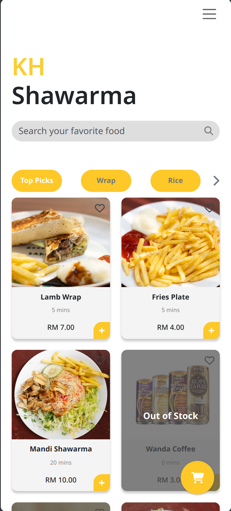
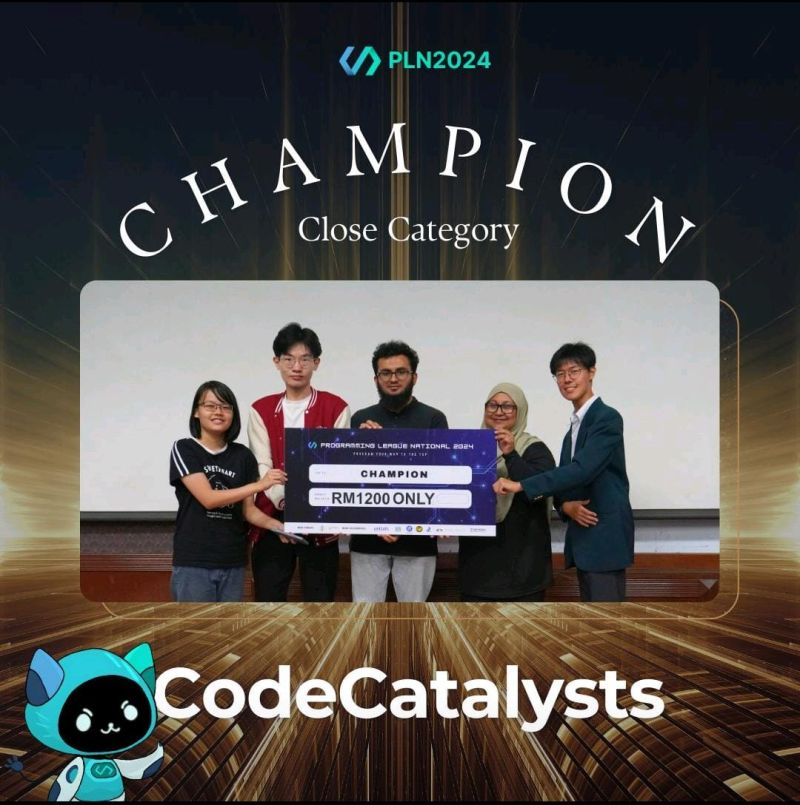

# Developer Portfolio

Welcome to my portfolio website! I'm Muhammad Mairaj, a passionate developer with expertise in web development, competitive programming, and mobile app development. I specialize in creating efficient, scalable, and user-friendly applications.

[(Jump to my recent projects)](#Projects)

## About Me
I started coding in 2020 and since then have delved into various fields like:
- **Frontend & Backend Development**: Using technologies such as React, Express.js, Node.js, Next.js, MongoDB, PostgresSQL, Flask, and Django.
    - Recently, I worked on a full-scale restaurant ordering and management system which is in operation at KH SHawarma, Engineering Faculty, Universiti Malaya. [KH Shawarma Project](#Restaurant-POS-System).
    - I also developed a [scheduler application](#MMScheduler) aimed at helping new Universiti Malaya students in planning their courses.
       
      
      
- **Desktop & Mobile Development**: Developed applications in Python (Tkinter - Desktop) and Java (Android).
    - Recently, I developed [Material Calculator](#Material-Calculator) for a local Steel Production Factory.
- **Competitive Programming**: Regularly participate in coding challenges.
    - Most recently, I was the **CHAMPION** of PLN 2024 Closed Category
       
      
    - Served as Technical Team Member for PEKOM Competitive Programming in Sem 2, 2023/24

Feel free to check out my latest projects and get in touch!

---

## Projects

### 1. MMScheduler
<small>*17 Sept 2024 - 30 Sept 2024*</small>
- A tool built to help Universiti Malaya students visualize and organize their timetables effectively.
    - ✅ All course names are in **English** , making it especially helpful for new students 🌟.
    - ✅ It includes **lecturer names** 🧑‍🏫, so you’ll know exactly who’s teaching each class. (currently only for fsktm and fac. engineering)
    - ✅ Covers a **wide range of courses** 📚, so that it is versatile.
- **Website:** [***https://mmscheduler.vercel.app***](https://mmscheduler.vercel.app)
- **Technologies used**: Next.js, React.js, Python, Selenium

### 2. Restaurant POS System
<small>*Aug 2024 - Sept 2024*</small>
- A full-scale restaurant management system developed with integrated backend support for order tracking, inventory management, and reporting.
- I worked with a team of 5 developers in developing a complete application for [KHShawarma](https://maps.app.goo.gl/J8JBKxdJpdGDEEcy5) at [Fakulti Kejuruteraan, Universiti Malaya](https://maps.app.goo.gl/BvfCVoxCW2ZFzW379), during the summer break 2024.
- I learned a lot during this project working as the Co-Lead Backend Engineer and Lead Security Engineer for the project, from the latest in frontend and backend development, to security considerations, to collaborative team development with GitHub
- **Website:** [***https://khshawarma.org***](https://khshawarma.org) (Please go to Engineering Faculty and try out the flow ;p)
- **Technologies used**: MERN Stack

### 3. Material Calculator
<small>*26 July 2024 - 5 Aug 2024*</small>
- A Desktop Application made for a local company that calculates the optimal amount of raw material required for steel production.
- **GitHub:** [Material-Calculator](https://github.com/Muhd-Mairaj/Material-Calculator-2.0)
- **Technologies used**: Python, Tkinter

### 4. NBA Game Manager
<small>*May 2024 - June 2024*</small>

### 5. Halal Bot
<small>*June 2023 - July 2023*</small>

---

## Skills

- **Languages**: Java, Python, JavaScript, HTML/CSS, C
- **Frameworks**: React.js, Django, Flask, Node.js
- **Tools & Technologies**: Git, Selenium, Linux (Fedora KDE)
- **Other Skills**: Web scraping, Database design, RESTful API development, Unit Testing, Linux system administration

---

## Experience

- **Freelance Developer**: Created several custom web and desktop solutions.
- **Problem Solver**: Worked on a full-stack development for a course scheduling system with Python and React.js.
- **Competitive Programming**: Active participant in coding competitions and challenges on platforms like Codeforces.

---

## Contact

You can reach me through the following channels:

- **GitHub**: [Muhd-Mairaj](https://github.com/Muhd-Mairaj)
- **Email**: [muhd.mairaj2003@gmail.com](muhd.mairaj2003@gmail.com)
- **LinkedIn**: [Connect with me on LinkedIn](https://linkedin.com/in/muhd-mairaj-4b194b294)
